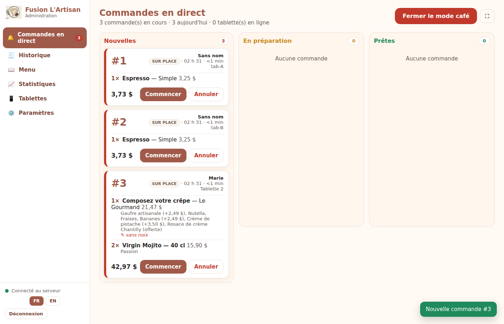
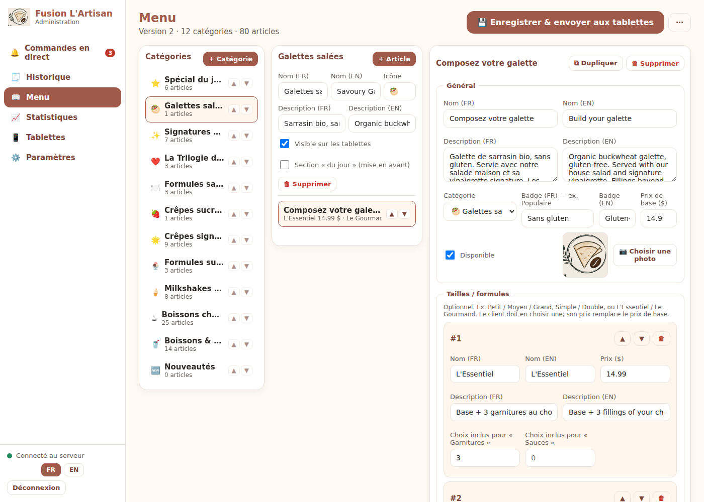
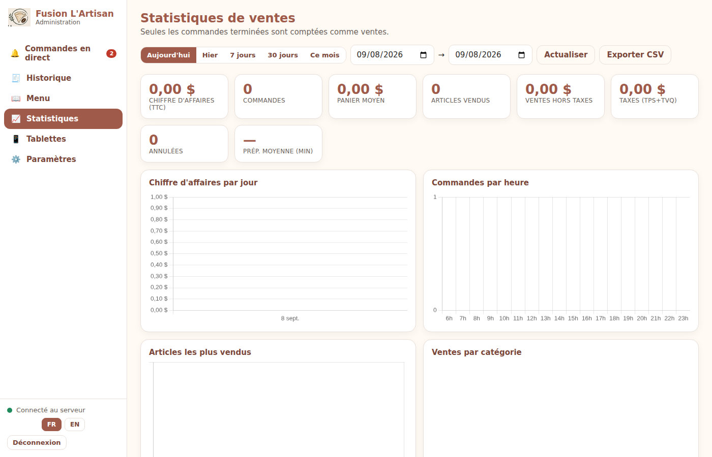
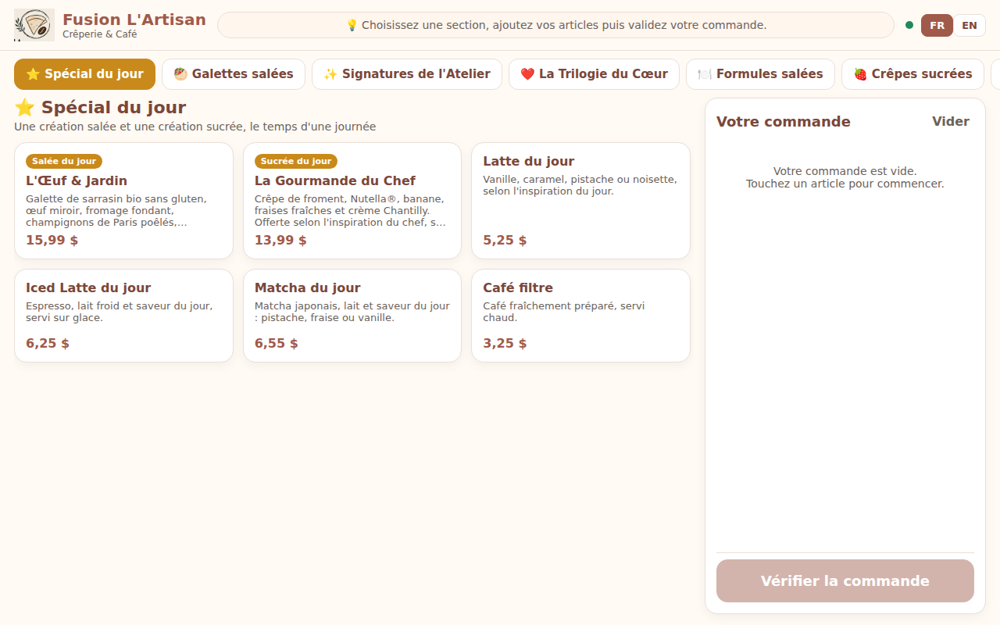
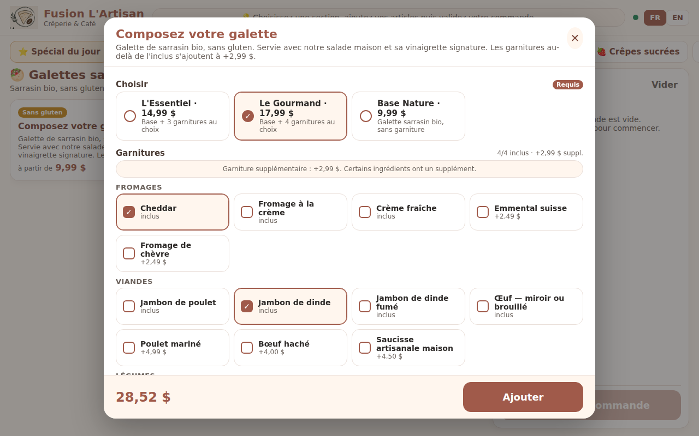
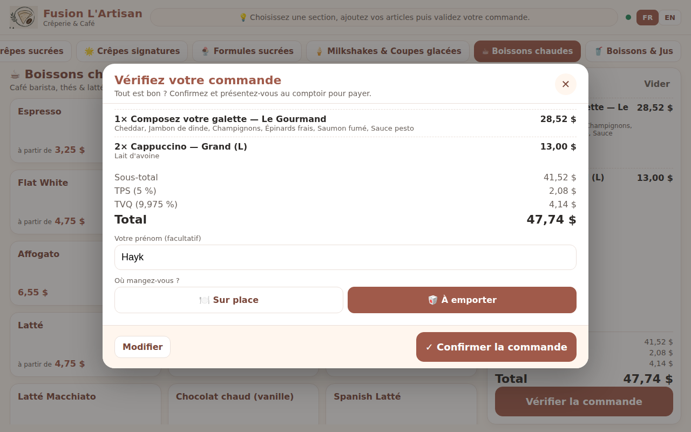

# L'Artisan Café — Tablet Ordering System

> 🇫🇷 Version française : [README.fr.md](README.fr.md). The detailed guides in `docs/` are written in French for the café staff; the technical reference ([docs/API.md](docs/API.md)) is easy to follow in either language.

A complete self-service ordering system for **Fusion L'Artisan** (crêperie & café, Montréal):
customers build their order on an Android tablet, the order lands instantly on the counter laptop with a sound alert,
and the admin manages the menu, orders and sales statistics from a web panel — **without ever touching code**.

Everything runs **locally on the café Wi-Fi**. No internet, no subscription, no online payment (customers pay at the counter).

```
   ┌────────────────┐        café Wi-Fi            ┌──────────────────────────────┐
   │ Tablet 1       │ ───── order ──────────────▶  │  Admin laptop                │
   │ (Android app)  │ ◀──── menu updates ───────── │  ┌────────────────────────┐  │
   └────────────────┘                              │  │ L'Artisan server       │  │
   ┌────────────────┐                              │  │ (Node.js + SQLite)     │  │
   │ Tablet 2       │ ───── order ──────────────▶  │  └───────────┬────────────┘  │
   └────────────────┘                              │              │               │
   ┌────────────────┐                              │  ┌───────────▼────────────┐  │
   │ Tablet N …     │                              │  │ Admin panel (web)      │  │
   └────────────────┘                              │  │ http://localhost:3000  │  │
                                                   │  │ /admin  — PIN 2121     │  │
                                                   │  └────────────────────────┘  │
                                                   └──────────────────────────────┘
```

## Documentation

| Document | Content |
|---|---|
| [docs/INSTALLATION.md](docs/INSTALLATION.md) | Install & start the server on Windows (and macOS later), firewall, auto-start |
| [docs/GUIDE_ADMIN.md](docs/GUIDE_ADMIN.md) | Admin panel user guide (café mode, menu editor, statistics, settings) |
| [docs/TABLETTES.md](docs/TABLETTES.md) | Build the Android APK, install it on tablets, configure, kiosk mode, web fallback |
| [docs/MENU_DATA.md](docs/MENU_DATA.md) | Menu structure, pricing rules, where every price came from and what to double-check |
| [docs/API.md](docs/API.md) | REST / WebSocket / UDP discovery / database reference |
| [docs/IMPRIMANTE.md](docs/IMPRIMANTE.md) | Receipt printer (Star TSP650 / ESC/POS): setup, automatic printing, reprint |
| [docs/SITE_WEB.md](docs/SITE_WEB.md) | Public website & online ordering: hours, pickup slots, tips, pay-at-pickup / Stripe, Google reviews |
| [docs/DEPLOIEMENT_RAILWAY.md](docs/DEPLOIEMENT_RAILWAY.md) | Hosting the server online on Railway (Volume for the database), connecting tablets and the print agent |
| [docs/DEPANNAGE.md](docs/DEPANNAGE.md) | Troubleshooting |

## What's in the box

```
lartisan-cafe/
├── README.md, README.fr.md
├── docs/                          ← guides (French) + API reference
├── server/                        ← server + admin panel + web version of the tablet menu
│   ├── start-windows.bat          ← DOUBLE-CLICK to start (Windows)
│   ├── start-macos.command        ← double-click to start (macOS)
│   ├── setup-firewall-windows.bat ← run once as Administrator if tablets can't reach the laptop
│   ├── src/                       ← Node.js server (no native dependencies)
│   ├── public/admin/              ← admin panel (vanilla JS, Chart.js vendored, works offline)
│   ├── public/tablet/             ← web version of the customer menu
│   ├── data/menu.seed.json        ← initial menu built from your PDFs / images / HTML
│   └── test/                      ← automated tests of the pricing engine (npm test)
├── android-app/                   ← Android Studio project (Kotlin + Jetpack Compose)
├── assets/                        ← logo extracted from your brand board, app icon
└── tools/                         ← build_menu_seed.py, update-app-menu.js
```

## Quick start

1. **Laptop**: install [Node.js LTS](https://nodejs.org) (22+), double-click `server/start-windows.bat`. The panel opens at <http://localhost:3000/admin> — **PIN 2121**.
2. *Tablets* tab: note the address shown (e.g. `http://192.168.1.20:3000`).
3. **Each tablet**: install the APK (see [docs/TABLETTES.md](docs/TABLETTES.md)), open the app, tap **Auto-discover** (or type the address), name the tablet, **Save**.
   No app yet? Open the same address in Chrome on the tablet — it is the same menu (web version).
4. In the panel: *Live orders* → **☕ Open the café**. Orders arrive with a chime.

## Features

**Customer tablet (Android app / web)** — FR/EN toggle · category tabs, item cards, cart on the right (layout follows your HTML mock-up) · configurable items: sizes (S/M/L, single/double), formulas (L'Essentiel / Le Gourmand), included vs extra fillings, surcharges, plant milk, quantity, note for the kitchen · live price · **Review screen** with subtotal, GST, QST, total, dine-in / take-out (customer first name optional, off by default) → **Confirm** · **Thank-you screen** with a big order number to give at the counter · menu **bundled in the app**, updated automatically when the admin saves (server pushes `menu_updated`, tablets re-download) · abandoned cart cleared after 5 min · long-press logo → PIN → tablet settings · follows the tablet's rotation (side cart in landscape, bottom bar in portrait) · example picture for every dish, replaceable by the admin · auto-discovery of the server on the LAN.

**Admin panel** — PIN login (2121, changeable, rate-limited) · **Live orders / café mode**: columns *New → Preparing → Ready*, chime once per new order (optional repeat every 20 s), full details, **Complete** rolls the card away, cancel, fullscreen · **Menu editor**: categories, items, FR/EN texts, photos, badges, sizes/formulas, option groups with included/extra pricing, availability toggles, daily-special section, JSON import/export, reset · **Statistics**: revenue, orders, average ticket, taxes, top items, by hour/day/category, dine-in vs take-out, per tablet, CSV export · **History**, **Tablets** (online status, menu version), **Settings** (name, **logo** — pushed live to tablets, taxes, sound, **receipt printer** with automatic ticket printing, PIN, numbering, backups, audit log). Bilingual UI.

**Public website & online ordering (v1.4)** — bilingual home page (intro, open/closed badge with today's hours, featured dishes, how-it-works, Google reviews, map & hours), `/commander` with the same menu and pricing rules as the tablets, pickup time (ASAP ≈ 15 min or 15-minute slots until closing), tips, **pay at pickup** (default) or **Stripe Checkout** (cards, Apple Pay, Google Pay) once you add keys, order-tracking page, closed-days / "temporarily closed" logic enforced server-side. Online orders show on the live board with a 🌐 badge, pickup time, phone and paid state. Everything is configured from the admin panel → *Site web*. The server can be **hosted on Railway** (database on a Volume, print agent on the café laptop) — see docs.

**Server** — Node.js 22+ only (built-in SQLite, two dependencies), zero internet needed in service, server-side price recomputation (`server/src/pricing.js` is the single source of truth; `Pricing.kt` mirrors it), nightly backups, WebSocket live updates, UDP discovery, multi-tablet.

## Important notes

- **Prices**: where your sources disagreed, **PDFs/images won over the HTML** (your choice). HTML-only items were added. Two drinks have no price on the juice PDF (Sunny Red, Pink Yuzu Fizz) → defaulted to $5.49, **please verify** in the menu editor. Full provenance table in [docs/MENU_DATA.md](docs/MENU_DATA.md).
- **APK**: the environment this was built in could not reach Google's Android SDK servers, so the Android Studio project is delivered complete and syntax-checked but **the APK must be built on your machine** (one click — step by step in [docs/TABLETTES.md](docs/TABLETTES.md)). The **web version** works right now on any tablet.
- **Taxes**: GST 5% + QST 9.975% on the subtotal (Québec), editable in Settings.
- **macOS later**: same `server/` folder, run `start-macos.command`; copy `server/data/lartisan.db` to keep history.

*Version 1.0.0 — September 2026.*

## Screenshots

| Admin — live orders | Admin — menu editor |
|---|---|
|  |  |

| Admin — statistics | Tablet — menu |
|---|---|
|  |  |

| Tablet — build a galette | Tablet — review & confirm |
|---|---|
|  |  |
